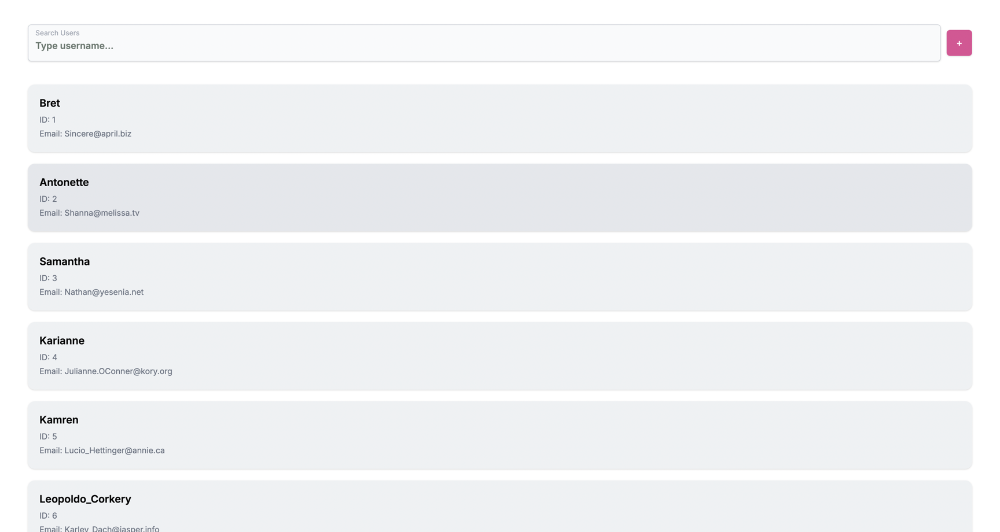

# 🚀 Test Project

A React application bootstrapped with [Create React App](https://github.com/facebook/create-react-app), utilizing
TypeScript for type safety and CRA for fast development builds. Api - https://jsonplaceholder.typicode.com/users

🔗 **Live Demo**: [test-eight-zeta-65.vercel.app](https://test-eight-zeta-65.vercel.app)

---

## ✨ Features

- ⚛️ React with TypeScript
- ⚡ CRA for rapid development
- 🎨 Prettier for code formatting
- 🧹 ESLint for code linting
- 🚀 Deployed on Vercel

---

## 🛠️ Getting Started

### 📋 Prerequisites

- 🟢 Node.js (v14 or higher)
- 📦 npm or yarn

### 📥 Installation

```bash
git clone https://github.com/DmitryFullStackDev/test.git
cd test
npm install
# or
yarn install
```

### ▶️ Running the App

```yaml
npm start
  # or
yarn start
```

### 📸 Preview


